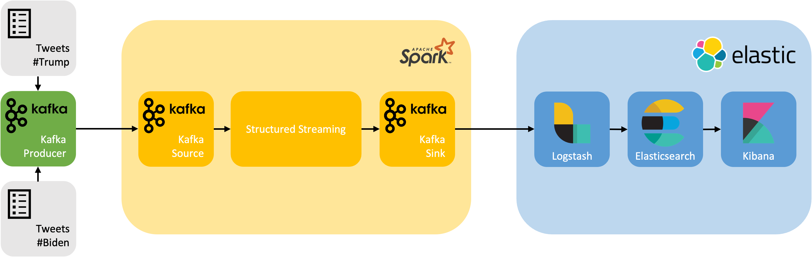

# Containerized Stream Processing with Docker - Tweet Analysis
[](https://www.elastic.co/blog/category/releases)

This project implements a large-scale and data-intensive application for real-time stream processing.

The streaming pipeline consists of [Apache Kafka](https://kafka.apache.org), [Apache Spark](https://spark.apache.org), as well as [Logstash](https://www.elastic.co/logstash/), [Elasticsearch](https://www.elastic.co/elasticsearch/), and [Kibana](https://www.elastic.co/kibana/) from the [Elastic Stack](https://www.elastic.co/elastic-stack/). With the use of Docker, the solution is assembled with isolated microservices orchestrated by docker-compose. The layout ensures reliability, scalability, and maintainability.

As an example use case, a Twitter dataset about the 2020 United States presidential election [(Hui, 2020)](#sources) is processed and visualized in a dashboard.

The followig architecture diagram illustrates the solution stack and the data flow:



## Table of Contents
1. [Requirements](#requirements)
1. [Installation](#installation)
1. [Usage](#usage)
1. [Delimitations](#delimitations)
1. [Sources](#sources)
1. [License](#license)

## Requirements
The following software is required to run the application [(Docker Inc., 2023)](#sources):
- [Docker Engine](https://docs.docker.com/get-docker/) version **19.03.0** or newer
- [Docker Compose](https://docs.docker.com/compose/install/) version **1.27.0** or newer

Please make sure that Docker has access to the following resources:
- At least **4 CPUs**
- At least **12 GB** of memory
- At least **32 GB** of disk space

## Installation
Clone this repository onto your system which fulfills the [requirements](#requirements):
```bash
git clone https://github.com/tobnag/containerized-stream-processing.git
```

Navigate into the project directory and create a new folder for a local copy of the Twitter dataset:
```bash
cd containerized-stream-processing
mkdir data
```

Download the Twitter dataset from [(Hui, 2020)](#sources) and extract the CSV files into the newly created folder. The folder should now contain the following files:
```bash
ls data/
hashtag_donaldtrump.csv hashtag_joebiden.csv
```

> **Note**
> If you like to rename of the data folder or the CSV files, make sure to update the corresponding environment variables in the [.env](./.env) file.

## Usage
The streaming pipeline consists of the following services, as defined in the [docker-compose.yml](./docker-compose.yml):
- [zookeeper](https://hub.docker.com/r/bitnami/zookeeper) - managing the Kafka cluster
- [kafka](https://hub.docker.com/r/bitnami/kafka) - transmitting messages in different parts of the pipeline
- [kafka-producer](./kafka/Dockerfile) - reading the CSV files and functioning as streaming source for the pipeline
- [spark-master](https://hub.docker.com/r/bitnami/spark) - managing the Spark cluster
- [spark-worker](https://hub.docker.com/r/bitnami/spark) - worker node of the Spark cluster
- [spark-submit](./spark/Dockerfile) - Spark application on the worker node for processing the streaming data
- [logstash](https://hub.docker.com/_/logstash) - taking the processed streaming data and writing it to Elasticsearch
- [elasticsearch](https://hub.docker.com/_/elasticsearch) - storing the streaming data in a NoSQL database
- [kibana](https://hub.docker.com/_/kibana) - providing the platform for visualizing the streaming data
- [kibana-dashboard](./kibana/dashboard/Dockerfile) - importing required objects into Kibana and providing a reverse proxy for accessing the dashboard

To start the streaming pipeline, run the following command in the project directory:
```bash
docker-compose up -d
```

The first run will take a while, as Docker needs to download and build the required images. As soon as the pipeline is up and running, the Kafka producer starts reading the CSV files and replays tweets according to their creation timestamps. The tweets are processed by Spark using the Structured Streaming API. Amongst other insights, a simple sentiment analysis is calculated based positive and negative word lists [(Mukul, 2020)](#sources). The results are written to Elasticsearch via Logstash and visualized in a Kibana dashboard.

The Kibana dashboard takes a few seconds to prepare. As soon as Kibana is ready, you can access the dashboard via a reverse proxy at http://localhost:8000.

The application will run until all tweets of the time period from October 15 to November 8, 2020, have been processed. You can stop the pipeline manually with the following command:
```bash
docker-compose down
```

> **Note**
> The simulation speed of the Kafka producer can be accelerated by changing the TIME_MULTIPLIER environment variable in the [.env](./.env) file. By default, this variable is set to 10, which means that the tweets are replayed ten times faster than real-time.

## Delimitations
The following delimitations apply to this project:
- The application is not designed for production use. It is intended to demonstrate the setup of a containerized streaming pipeline with Docker.
- Although this application is capable of running in a distributed environment, the present configuration is optimized for a single-node setup.
- For simplicity reasons, security features such as authentication, authorization, and encryption are not implemented.
- The application does not store data persistently. If the pipeline or a single service is stopped at runtime, the pipeline needs to be restarted.
- The sentiment analysis is based on a simple word list approach. The results are not very accurate and should be interpreted with caution. Moreover, only English words can be interpreted.
- The Kibana dashboard has a minimum refresh rate of one second due to system limitations. This adds a small delay to the visualization of the streaming data.

## Sources
The following sources were used to create this project:
- Docker Inc. (2023). *Compose file versions and upgrading*. Retrieved May 15, 2023, from https://docs.docker.com/compose/compose-file/compose-versioning/
- Hui, M. (2020, November 9). *US election 2020 tweets*. Retrieved May 15, 2023, from https://www.kaggle.com/manchunhui/us-election-2020-tweets
- Mukul (2020, September 12). *Positive and negative word list*. Retrieved May 15, 2023, from https://www.kaggle.com/datasets/mukulkirti/positive-and-negative-word-listrar

## License
This project is licensed under the terms of the [MIT license](./LICENSE).